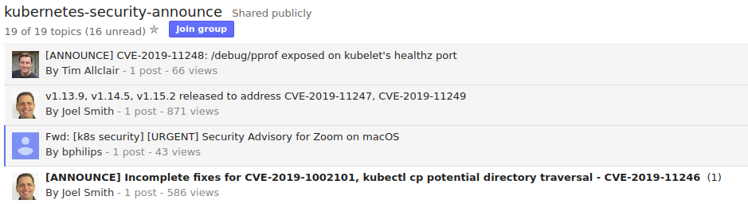

# Vulnerabilities

Watch out for critical vulnerabilities on Kubernetes security announce forum

Also, check out GitHub [issues](https://github.com/kubernetes/kubernetes/labels/area%2Fsecurity)

## Kubernetes specific

- [CVE-2019-11248](https://groups.google.com/forum/#!topic/kubernetes-security-announce/pKELclHIov8)

> The debugging endpoint /debug/pprof is exposed over the unauthenticated Kubelet healthz port.

Affected: < 1.15.0, 1.14.4, 1.13.8, 1.12.10

- [CVE-2018-1002105](https://nvd.nist.gov/vuln/detail/CVE-2018-1002105)

> With a specially crafted request, users that are authorized to establish a connection through the Kubernetes API server to a backend server can then send arbitrary requests over the same connection directly to that backend, authenticated with the Kubernetes API server’s TLS credentials used to establish the backend connection.

Affected: < 1.10.11, < 1.11.5, <1.12.3

PoCs: [authenticated](https://www.exploit-db.com/exploits/46053)/[unauthenticated](https://www.exploit-db.com/exploits/46052)
